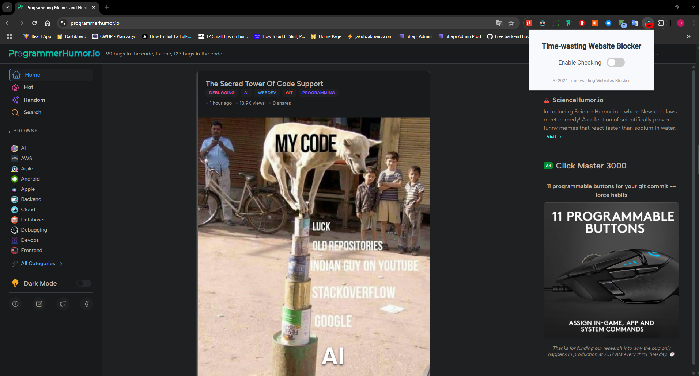
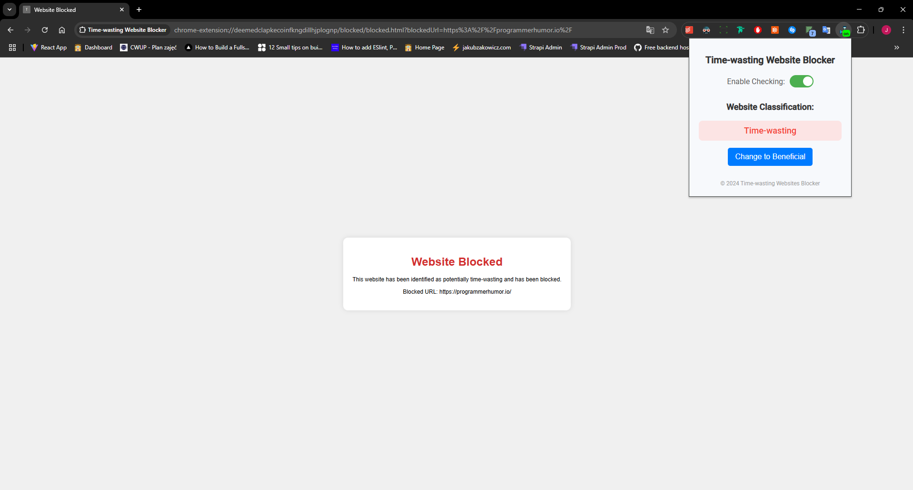

# Time-wasting website blocker 

Chrome extension that blocks time-wasting websites to keep you more focused and productive. 

## How does it work?

This extension takes metadata and first three headers and paragraphs from the website, passes them to llama3-8b-8192 model deployed on [GroqCloud](https://groq.com/), which decides if the website is beneficial or time-wasting.

## Extension disabled

## Extension enabled
